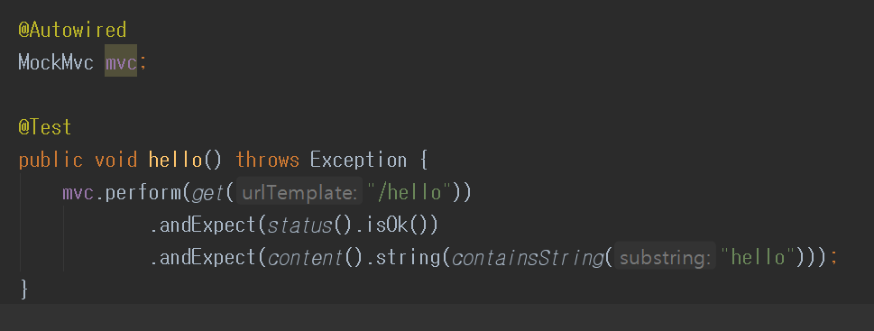
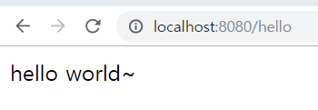
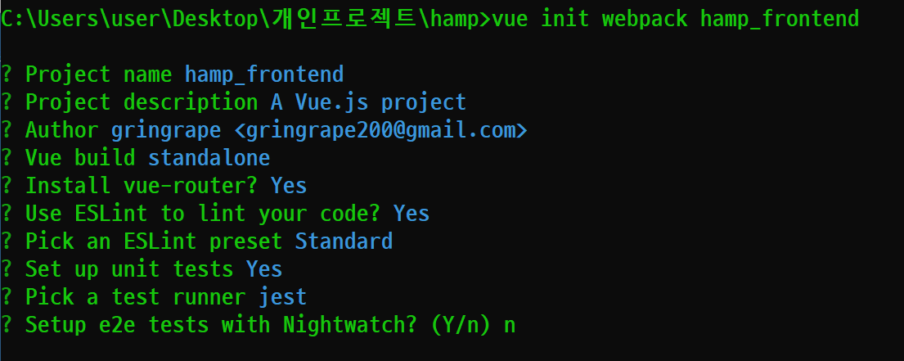
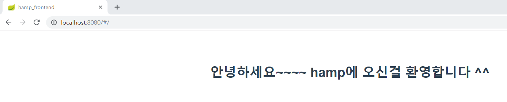
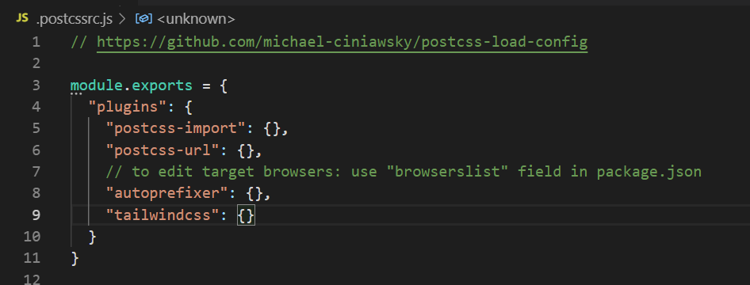
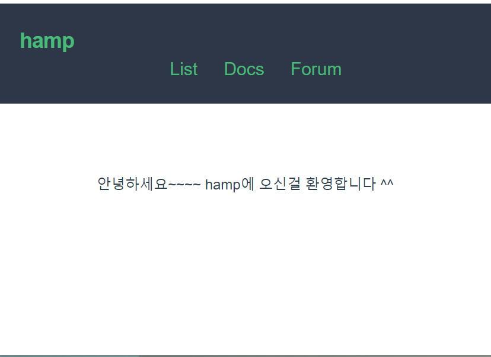

## 목표
- [x] 백엔드 환경설정
- [x] 프론트 엔드 환경설정
- [ ] 모임 entity 설계 
- [ ] 모임 list get api

## 1. 백엔드 환경설정
#### 1.1. 스펙
- spring boot 2.1.7
- java jdk 1.8
- gradle

#### 1.2. 외부 의존성 
- h2 database
- jpa
- web starter
- dev tools 

#### 1.3. 환경설정
- **start.spring.io 이용**
 

- **helloworld 출력**
	- UI layer -> package: interfaces -> HelloController.java
	- Test code

		- http 200 번 상태 코드
		- return 문자열 hello 포함
		- test 성공

#### 1.4. 오류 수정
- **application 구동 실패** 
	- 원인: h2 데이터 베이스 외부 의존성 설정
	- 해결: gradle 의존성 설정 방법을 찾는다 -> h2 데이터 베이스 의존성을 추가한다.
	```
	dependecies {
		implementation 'com.h2database:h2:1.4.199' 
	}
  ```

	- **해결성공**

### 공부
#### 1. devtools 의 역할

#### 2. @RestController,  @Controller 의 차이

#### 3. gradle declaring dependencies
- 참고
	- https://docs.gradle.org/current/userguide/declaring_dependencies.html 

## 2. 프론트엔드 환경설정

#### 2.1 vue webpack
  

  - **HelloWorld 출력** 
- HelloWorld.vue component 수정
      - v-text 이용, vue 객체에서 msg 변수에 저장된 값을 출력
    - <router-view>에 반영
      - App.vue component 수정
	- 이미지 삭제
    - helloworld 출력
    

#### 2.2 tailwindcss

- https://tailwindcss.com/docs/installation/ 페이지 참조.

- **tailwindcss 설치**
```
Using npm
  npm install tailwindcss
```
- **PostCss 플러그인 설정**
 
- css import -> app.vue component에 css import
```css
@tailwind base;

@tailwind components;

@tailwind utilities;
```
#### 2.3. helloworld


### 공부
#### 1. webpack의 기능